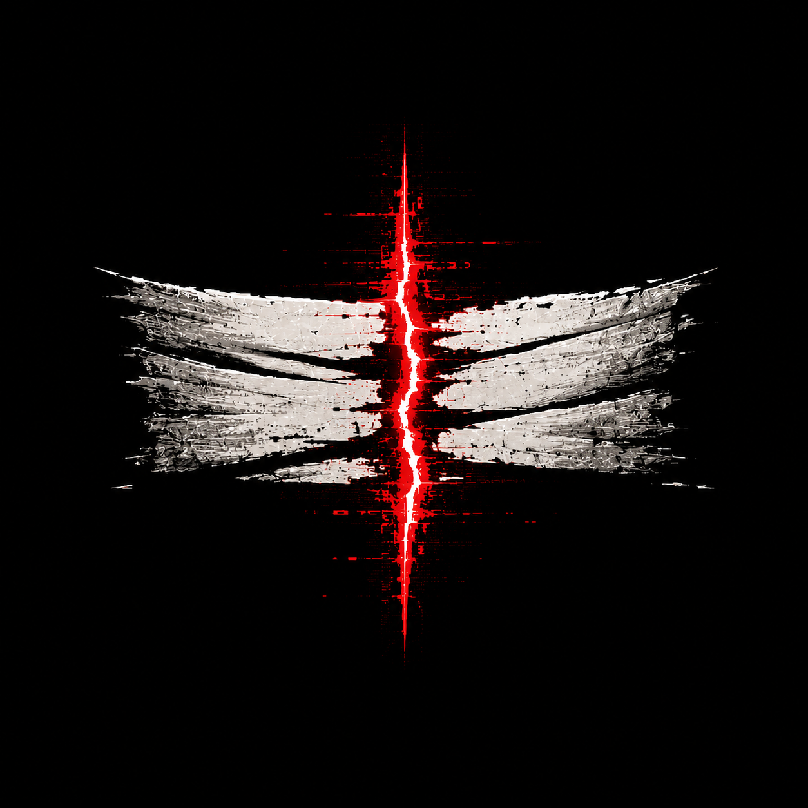
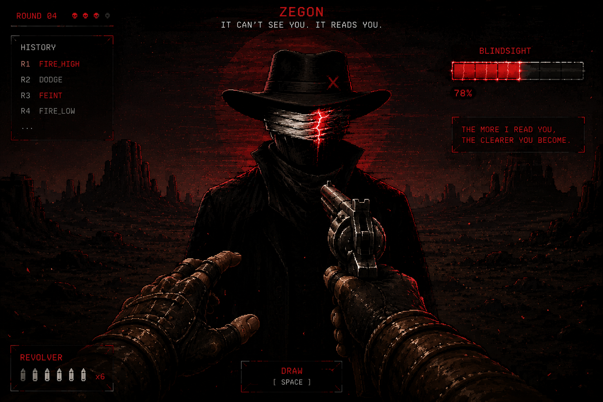
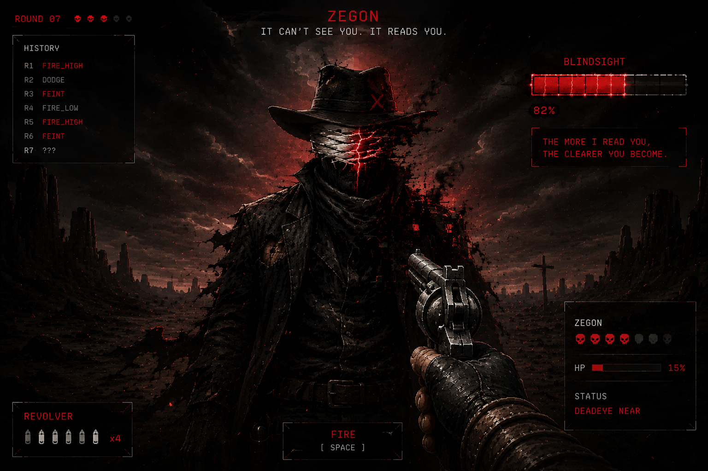
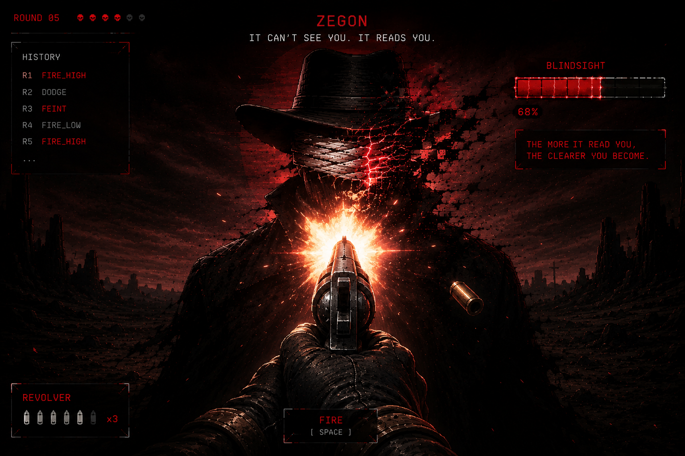
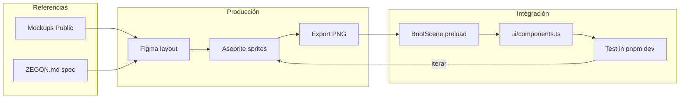

# Plan de arte — ZEGON

> Guía para elaborar la interfaz y assets del juego.  
> **Audiencia:** artista UI/pixel, diseñador, integrador.  
> **Referencia de producto:** [ZEGON.md](../ZEGON.md) §6 (Dirección Visual).  
> **Código actual:** UI procedural en `packages/game-client/src/ui/` — los assets reemplazan piezas una a una.

---

## 0. Regla de oro

```
❌ NO exportar mockups completos con HUD + texto + personaje en un solo PNG
✅ SÍ exportar CAPAS separadas, sin texto, fondo transparente donde aplique
```

Los archivos en esta carpeta (`Public/`) son **referencias de mood y layout**, no assets finales para pegar en el juego.

---

## 1. Referencias visuales actuales (ejemplos)

Cada imagen indica **qué copiar** (estilo, composición) y **qué extraer** (capas a producir).

### 1.1 `banner.png` — Identidad de marca


| Qué observar | Qué producir |
|--------------|--------------|
| Silueta con sombrero + venda roja vertical | Sprite `zegon_silhouette.png` (solo personaje, transparente) |
| Logo tipográfico con ojo en la O | `logo_zegon.png` + variante glitch |
| Tagline en rojo ember | Texto lo pone el juego (i18n) — **no quemar en PNG** |
| Sol/rojo sangre detrás del personaje | Capa `bg_sun.png` separada (círculo rojo, alpha) |
| Footer 0G (Compute / Chain / Storage) | Iconos 32×32 opcionales para pantalla Verify |

**Uso en juego:** pantalla de resultado, marketing, tarjeta compartible VERIFY.

---

### 1.2 `logo_zegon.png` — Logo aislado



| Entregable | Spec |
|------------|------|
| `logo_zegon.png` | PNG transparente, ~800×200 px, blanco `--bone` |
| `logo_zegon_glitch.png` | Misma silueta con split RGB cyan/magenta (DEADEYE, hover) |

**Anclaje:** centro horizontal, base inferior del logo.

---

### 1.3 `menú inicio.png` — Pantalla de título


| Qué observar | Qué producir |
|--------------|--------------|
| Composición vertical: logo → tagline → botón PLAY → footer | Layout (coordenadas abajo §5) |
| Botón rojo con borde ember | Nine-slice `ui/btn_primary_*.png` (normal, hover, pressed) |
| Personaje + desierto de fondo | `bg_title_desert.png` + `zegon_title.png` separados |
| Texto "ENTER THE DUEL", wallet, etc. | **No incluir** — el juego usa strings EN/ES |

**Pantallas que cubre:** Title, Settings (mismo marco visual).

---

### 1.4 `normal.png` — Duelo (estado estable)



| Qué observar | Qué producir |
|--------------|--------------|
| Vista 1ª persona + ZEGON al centro | Capas: `bg_desert.png`, `zegon_idle.png`, `player_hands_idle.png` |
| HUD: ROUND, HISTORY, BLINDSIGHT, botones | Marcos UI §4.2 — **sin texto** |
| Barra Blindsight segmentada arriba derecha | `ui/blindsight_segment_on.png` + `_off.png` |
| Revólver + contador munición | Iconos bala 12×12, sprite manos |

**Estado de juego:** Blindsight 0–60 %, ambiente tenso pero estable, glitch mínimo.

---

### 1.5 `dañado.png` — Duelo (estado crítico)



| Qué observar | Qué producir |
|--------------|--------------|
| Más partículas, rojo intenso, ZEGON casi disuelto | `zegon_deadeye.png` o overlay `vfx_corruption.png` |
| "DEADEYE NEAR" | Texto del juego — no en PNG |
| HP bajo (15 %) | Barra hecha en código con `ui/hp_fill_ember.png` |
| Cielo más tormentoso | Variante `bg_desert_storm.png` o tint rojo en código |

**Estado de juego:** Blindsight ≥ 70 %, ZEGON HP bajo, o jugador herido.

---

### 1.6 `disparo.png` — Acción de disparo



| Qué observar | Qué producir |
|--------------|--------------|
| Flash de boca, casquillo eyectado | Spritesheet `vfx_muzzle_flash.png` (4 frames) |
| Chispas en ZEGON al impactar | `vfx_hit_sparks.png` (3–4 frames) |
| Manos + revólver en posición de fuego | `player_hands_fire_01–04.png` |

**Trigger en código:** acciones `FIRE_HIGH` / `FIRE_LOW`.

---

### 1.7 `tu turno.png` — Layout de turno del jugador


| Qué observar | Qué producir |
|--------------|--------------|
| Botonera horizontal de 5 acciones | `ui/btn_action.png` + iconos §4.3 |
| Panel central "ZEGON HAS LOCKED IN" | Marco `ui/panel_prompt.png` |
| Secuencia DESENFUNDA → APUNTA → LISTO | Spritesheet `player_draw_01–06.png` |
| Stats YOU / ZEGON con iconos corazón/calavera | `ui/icon_heart.png`, `ui/icon_skull.png` |
| Texto en español abajo | Referencia de copy — va en i18n, no en PNG |

**Pantalla de referencia principal** para posiciones del HUD en §5.

---

## 2. Dirección de arte (resumen)

### 2.1 Tono
**Dark neo-western × cyber-glitch.** Western spaghetti visto a través de un CRT corrupto. Tensión, soledad, suciedad controlada.

### 2.2 Resolución de trabajo

| Contexto | Resolución | Notas |
|----------|------------|-------|
| **Lógica del juego (ZEGON.md)** | 426×240 | Pixel art interno, nearest-neighbor |
| **Cliente web actual (Phaser)** | 854×480 | 2× del interno — **recomendado exportar a esta resolución** |
| **Export master (opcional)** | 1708×960 | 4× para retina; escalar down en build |

Trabajar en **854×480** o múltiplos exactos evita blur.

### 2.3 Paleta obligatoria

| Token | Hex | Uso |
|-------|-----|-----|
| `--void` | `#0A0911` | Fondo principal |
| `--ash` | `#14121C` | Paneles |
| `--smoke` | `#211E2E` | Superficies elevadas |
| `--fog` | `#3A3550` | Bordes, divisores |
| `--bone` | `#E6E1D3` | Texto principal |
| `--dust` | `#9A93A8` | Texto secundario |
| `--cyan` | `#2EE6D6` | Tech, VERIFY, hover |
| `--magenta` | `#FF2E88` | Glitch split |
| `--ember` | `#FF4D2E` | Venda, Blindsight, DEADEYE |
| `--blood` | `#B3122B` | Daño, impactos |
| `--verified` | `#4DF07A` | Solo confirmación on-chain |
| `--gold` | `#E8B23A` | Armas raras (futuro) |

**Regla:** 90 % de la pantalla en tonos void/ash/smoke. Verde `--verified` solo para VERIFY.

### 2.4 Tipografía
- **HUD / terminal:** [VT323](https://fonts.google.com/specimen/VT323) — ya integrada.
- **Logo:** pixel display bold, glitcheable (no VT323).

### 2.5 Glitch (atado a Blindsight)

| Blindsight | Efecto visual |
|------------|---------------|
| 0–30 % | Mundo estable, scanlines leves |
| 31–60 % | Split RGB sutil en venda de ZEGON |
| 61–80 % | Block-glitch en bordes de pantalla |
| 81–100 % | DEADEYE: pantalla ember, glitch máximo, venda abierta |

El glitch **no es decoración random** — es feedback de que ZEGON te está leyendo.

---

## 3. Estructura de carpetas para entregables

```
Public/
  ART_PLAN.md          ← este documento
  _references/         ← mockups actuales (solo referencia, no runtime)
  ui/
    panels/
    buttons/
    icons/
    bars/
  characters/
    zegon/
    player_hands/
  backgrounds/
  vfx/
  logo/
  audio/               ← opcional fase 2
```

**Convención de nombres:** `snake_case`, sin espacios ni acentos.  
Ejemplo: `btn_primary_hover.png`, no `Botón Principal (1).png`.

---

## 4. Lista maestra de assets

### 4.1 Logo e identidad

| Archivo | Tamaño | Frames | Prioridad |
|---------|--------|--------|-----------|
| `logo/logo_zegon.png` | 800×200 | 1 | P0 |
| `logo/logo_zegon_glitch.png` | 800×200 | 1 | P1 |
| `logo/icon_skull.png` | 32×32 | 1 | P2 |

### 4.2 UI — marcos y botones

| Archivo | Tamaño | Notas |
|---------|--------|-------|
| `ui/panels/panel_dark_9slice.png` | 64×64 | Nine-slice 8px; relleno `--ash` |
| `ui/panels/panel_prompt.png` | 400×80 | Centro del duelo (tu turno) |
| `ui/buttons/btn_primary_normal.png` | 280×44 | Borde `--blood` |
| `ui/buttons/btn_primary_hover.png` | 280×44 | Borde `--cyan` |
| `ui/buttons/btn_action_normal.png` | 140×36 | Botonera inferior |
| `ui/buttons/btn_action_hover.png` | 140×36 | |
| `ui/buttons/btn_action_disabled.png` | 140×36 | Alpha ~50 % |

### 4.3 UI — iconos de acciones

| Archivo | Tamaño | Acción |
|---------|--------|--------|
| `ui/icons/icon_fire_high.png` | 24×24 | Disparo alto |
| `ui/icons/icon_fire_low.png` | 24×24 | Disparo bajo |
| `ui/icons/icon_dodge.png` | 24×24 | Esquivar |
| `ui/icons/icon_feint.png` | 24×24 | Finta |
| `ui/icons/icon_reload.png` | 24×24 | Recargar |
| `ui/icons/icon_heart.png` | 16×16 | HP jugador |
| `ui/icons/icon_skull.png` | 16×16 | HP ZEGON |
| `ui/icons/icon_bullet.png` | 12×12 | Munición |

### 4.4 UI — barras

| Archivo | Tamaño | Uso |
|---------|--------|-----|
| `ui/bars/blindsight_segment_off.png` | 16×8 | Segmento vacío |
| `ui/bars/blindsight_segment_on.png` | 16×8 | Segmento lleno ember |
| `ui/bars/hp_fill_cyan.png` | 4×6 | Fill barra jugador |
| `ui/bars/hp_fill_ember.png` | 4×6 | Fill barra ZEGON |
| `ui/bars/hp_bg.png` | 120×6 | Fondo barra |

### 4.5 Fondos (capas separadas)

| Archivo | Tamaño | Capa |
|---------|--------|------|
| `backgrounds/sky_void.png` | 854×280 | Cielo oscuro |
| `backgrounds/sky_storm.png` | 854×280 | Variante DEADEYE |
| `backgrounds/sun_blood.png` | 180×180 | Sol rojo (alpha) |
| `backgrounds/desert_ground.png` | 854×200 | Suelo |
| `backgrounds/mesa_left.png` | 120×80 | Silueta roca izq. |
| `backgrounds/mesa_right.png` | 120×80 | Silueta roca der. |

### 4.6 Personaje — ZEGON

Altura del sprite: **48–64 px** (personaje completo).

| Archivo | Frames | Estado |
|---------|--------|--------|
| `characters/zegon/zegon_idle.png` | 1–2 | Reposo, venda apagada |
| `characters/zegon/zegon_reading.png` | 2–4 | Venda pulsa (loop) |
| `characters/zegon/zegon_deadeye.png` | 1–2 | Venda abierta, ember máximo |
| `characters/zegon/zegon_hit.png` | 1 | Reacción al daño |
| `characters/zegon/zegon_dead.png` | 1 | Derrota |

**Anclaje:** centro inferior (pies en y=0 del sprite).

Referencia de silueta: `banner.png`, `normal.png`.

### 4.7 Jugador — manos 1ª persona

| Archivo | Frames | Acción |
|---------|--------|--------|
| `characters/player/player_idle.png` | 1–2 | Reposo |
| `characters/player/player_draw_01–06.png` | 6 | Desenfundar |
| `characters/player/player_aim.png` | 1 | Apuntar |
| `characters/player/player_fire_01–04.png` | 4 | Disparo |
| `characters/player/player_reload_01–04.png` | 4 | Recarga |
| `characters/player/player_dodge.png` | 1 | Esquiva |

Referencia: secuencia inferior de `tu turno.png`, centro de `disparo.png`.

### 4.8 VFX

| Archivo | Frames | Trigger |
|---------|--------|---------|
| `vfx/muzzle_flash.png` | 4 | FIRE_* |
| `vfx/shell_casing.png` | 1 | FIRE_* (tween caída) |
| `vfx/hit_sparks.png` | 4 | Impacto en ZEGON |
| `vfx/damage_flash.png` | 1 | Jugador recibe daño |
| `vfx/glitch_overlay.png` | 1 | Tile 64×64, alpha, Blindsight alto |
| `vfx/deadeye_burst.png` | 3 | DEADEYE activado |

### 4.9 Post-procesado

| Archivo | Tamaño | Uso |
|---------|--------|-----|
| `vfx/scanlines.png` | 854×480 | Overlay CRT, alpha 6–10 % |
| `vfx/vignette.png` | 854×480 | Oscurecer bordes |

---

## 5. Layout del duelo (854×480)

Coordenadas de anclaje para alinear art con el HUD del juego:

```
┌────────────────────────────────────────────────────────────── 854px
│  RONDA [x:20,y:14]              BLINDSIGHT [x:638,y:38, w:196] │
│  ┌ HISTORIAL ──┐                              ┌ taunt ──────┐ │
│  │ x:20,y:52   │                              │ x:427,y:290 │ │
│  │ 160×110     │         ZEGON x:427,y:200    │ max 340w    │ │
│  └─────────────┘              ↑                └─────────────┘ │
│                         (sprite 64px)                          │
│              PROMPT x:427,y:86                                 │
│  TÚ + HP bar [20, 372]              ZEGON + HP [714, 372]     │
│  ┌────┬────┬────┬────┬────┐  y:448                              │
│  │ FH │ FL │ DD │ FT │ RL │  botonera acciones                  │
│  └────┴────┴────┴────┴────┘                                     │
└────────────────────────────────────────────────────────────── 480px
   FH=FIRE_HIGH  FL=FIRE_LOW  DD=DODGE  FT=FEINT  RL=RELOAD
```

**Capas (depth, de atrás adelante):**
1. Fondo desierto (sky + ground + mesas)
2. Sol rojo (pulsa con Blindsight)
3. ZEGON (sprite animado)
4. Manos jugador (1ª persona, borde inferior)
5. HUD paneles + texto
6. VFX (flash, partículas)
7. Scanlines / glitch overlay

---

## 6. Plan de producción por fases

### Fase 0 — Setup (medio día)
- [ ] Crear archivo Figma/Aseprite con paleta §2.3
- [ ] Mover mockups actuales a `Public/_references/`
- [ ] Crear carpetas §3 vacías

### Fase 1 — Identidad + menú (2 días) — **P0**
- [ ] `logo_zegon.png`
- [ ] `btn_primary_*.png`, `panel_dark_9slice.png`
- [ ] `bg_title_desert.png` + `zegon_title.png`
- [ ] Integrar en `TitleScene` y `SettingsScene`

**Criterio de aceptación:** menú reconocible como ZEGON sin rects procedural.

### Fase 2 — Duelo base (3 días) — **P0**
- [ ] Fondos en capas §4.5
- [ ] `zegon_idle.png` + `zegon_reading.png`
- [ ] Marcos HUD + iconos acciones §4.3
- [ ] Barras Blindsight §4.4
- [ ] Integrar en `DuelScene` (reemplazar `drawDesertBackdrop`, `drawZegonFigure`)

**Referencia principal:** `normal.png`, `tu turno.png`

### Fase 3 — Combate y feedback (2 días) — **P1**
- [ ] Manos: idle, draw, fire §4.7
- [ ] VFX disparo e impacto §4.8
- [ ] `zegon_hit.png`, `zegon_deadeye.png`
- [ ] Variante `sky_storm.png` o tint ember

**Referencia:** `disparo.png`, `dañado.png`

### Fase 4 — Glitch + DEADEYE (1–2 días) — **P1**
- [ ] `logo_zegon_glitch.png`
- [ ] `glitch_overlay.png`, `scanlines.png`
- [ ] Animación venda (reading loop)
- [ ] Shader o sprite swap por nivel de Blindsight

### Fase 5 — Resultado + VERIFY (1 día) — **P1**
- [ ] Panel resultado (marco + iconos 0G opcionales)
- [ ] Estilo botón VERIFY (`--cyan`) vs SHARE (`--bone`)
- [ ] Tarjeta exportable 1200×630 para redes (usa `banner.png` como guía)

### Fase 6 — Polish (continuo) — **P2**
- [ ] Audio §ZEGON.md 6.7
- [ ] Animación recarga y esquiva
- [ ] Leaderboard / Daily (futuro)
- [ ] Armas alternativas (Glitch Pistol = `--gold`)

---

## 7. Formato de exportación

### PNG estático
- Color: RGBA
- Fondo: **transparente** (excepto fondos full-screen)
- Compresión: lossless

### Spritesheet (Aseprite → Phaser)
Exportar JSON + PNG:
```json
{
  "frames": { "zegon_reading_0": { "frame": { "x":0,"y":0,"w":48,"h":64 } } },
  "meta": { "image": "zegon_reading.png", "size": { "w":192,"h":64 } }
}
```

Nombre: `zegon_reading.json` + `zegon_reading.png`

### Nine-slice (botones/paneles)
- Borde mínimo 8px
- Centro stretchable
- Documentar insets en nombre de archivo o README del asset

---

## 8. Integración en el código

| Asset listo | Reemplaza en código |
|-------------|---------------------|
| Fondos §4.5 | `drawDesertBackdrop()` en `ui/components.ts` |
| ZEGON §4.6 | `drawZegonFigure()` → `Phaser.Animations` |
| Botones §4.2 | `createMenuButton()`, `createActionButton()` |
| Barras §4.4 | `drawBlindsightMeter()`, `drawHpBar()` |
| Logo | `TitleScene`, `ResultScene` |
| VFX §4.8 | `DuelScene.playFireFlash()` |

**Precarga:** al reintroducir assets, crear `BootScene` con `this.load.image()` / `this.load.spritesheet()`.

**i18n:** todo texto visible sigue en `packages/game-client/src/i18n/` — los PNG **nunca** llevan copy.

---

## 9. Checklist de calidad por asset

Antes de entregar cada PNG, verificar:

- [ ] ¿Está en la paleta §2.3?
- [ ] ¿Fondo transparente (si aplica)?
- [ ] ¿Sin texto quemado?
- [ ] ¿Nombre snake_case sin espacios?
- [ ] ¿Tamaño múltiplo de 2 respecto a 854×480?
- [ ] ¿Anclaje documentado?
- [ ] ¿Probado sobre fondo `--void` (#0A0911)?

---

## 10. Flujo de trabajo recomendado



---

## 11. Priorización resumida

| Prioridad | Entregables | Días est. |
|-----------|-------------|-----------|
| **P0** | Logo, botones, fondo duelo, ZEGON idle, HUD marcos | 5 |
| **P1** | Manos, disparo VFX, DEADEYE, glitch, resultado | 4 |
| **P2** | Audio, animaciones extra, banner social | 3+ |

**Total MVP visual:** ~9–12 días de arte (1 artista) + integración en paralelo.

---

## 12. Contacto / entrega

Entregar assets vía:
1. PR al repo en `Public/ui/`, `Public/characters/`, etc.
2. O ZIP con la estructura §3 + hoja de anclajes (Google Sheet opcional)

Al abrir PR, indicar qué función de `ui/components.ts` reemplaza cada asset para facilitar la integración.

---

*Documento vivo — actualizar cuando cambien resolución base o pantallas del MVP.*
